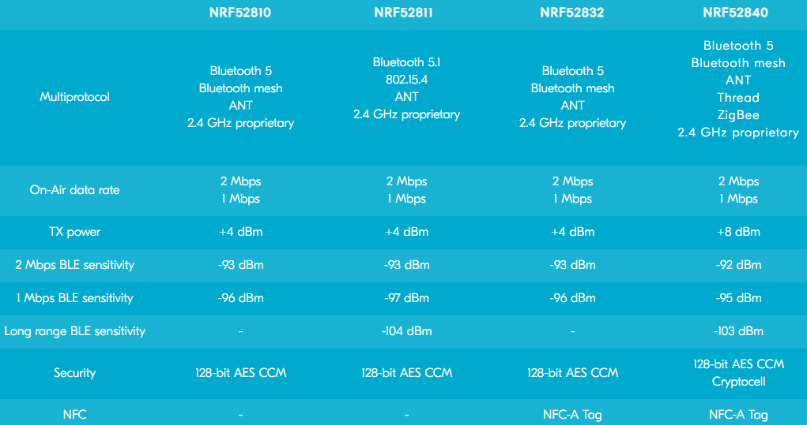

# [NRF52](https://github.com/sochub/NRF52)
 
####  qitas@qitas.cn
#### 父级：[Nordic](https://github.com/sochub/Nordic) 
#### 归属：[Cortex M4](https://github.com/sochub/CM4) 
## [简介](https://github.com/sochub/NRF52/wiki)

nRF52系列采用64MHz ARM® Cortex®-M4F内核，支持BLE 5.0和Bluetooth mesh功能，nRF52系列SoC支持多种通信协议。

nRF52较之nRF51系列的功耗降低，性能提升，nRF51系列的功耗约为8.3mA到10mA，而nRF52832的峰值功耗也才5.5mA。

 

### [收录型号](https://github.com/sochub/NRF52)

* [nRF52810](https://github.com/sochub/nRF52810) 
* [nRF52811](https://github.com/sochub/nRF52811) 
* [nRF52832](https://github.com/sochub/nRF52832) 
* [nRF52840](https://github.com/sochub/nRF52840) 

### [收录资源](https://github.com/sochub/NRF52)

* [参考文档](docs/)
* [参考资源](src/)
* [模板工程](demo/)
* [编译工具](https://github.com/sochub/arm-none-eabi)

### [替换方案](https://github.com/sochub/NRF52)

* 向下替换方案 [NRF51](NRF51) 
* 音频替换方案 [CSR](https://github.com/sochub/CSR) 

##  [SoC资源平台](http://www.qitas.cn)

